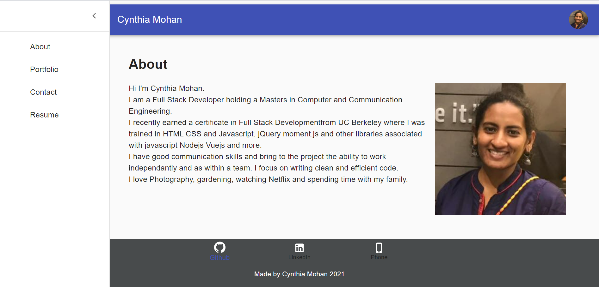

# Portfolio Using React

## Description 
This is a portfolio to describe my past experience and projects using my new React skills. This will enable potential employers to look at my code and determine if I'm a good candidate for their company

## User Story
AS AN employer looking for candidates with experience building single-page applications
I WANT to view a potential employee's deployed React portfolio of work samples
SO THAT I can assess whether they're a good candidate for an open position

## Table of Contents 

* [Usage](#usage)
* [License](#license)
* [Technologies](#Technologies)
* [Screenshots](#Screenshots)
* [Questions](#questions)

## Usage 

View my Portfolio
[here](https://cynthiamohan.github.io/cynthia-react-portfolio/)

## License

This Application is covered under : 

[mit](https://choosealicense.com/licenses/mit)
 

## Technologies
* React
* Material-UI

## Screenshots

## Questions
View my Github Profile at [CynthiaMohan](http://github.com/CynthiaMohan)
 
Reach me with more questions <cynthiamohan1@gmail.com>

